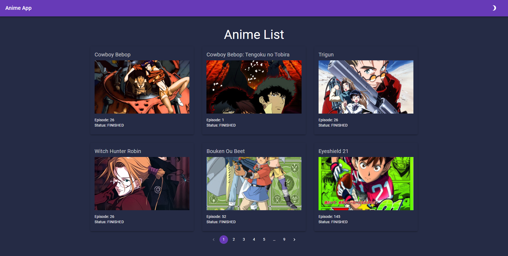
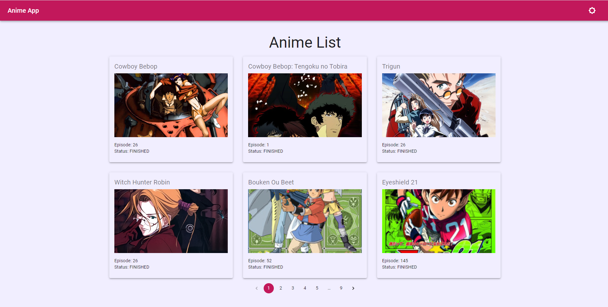

## Interview Project

This is an interview project. Used -
React js
Graphql API (apollo-client)
Material UI

### How to run this

1. Clone this repo
2. Go to the location using terminal/cmd and write `npm install`
3. After installing packages write `npm start` or `yarn start` to run
4. It will open browser on `http://localhost:3000/`

## Live Link

- [reactjs-graphql-material](https://interview-for-ocm.netlify.app/) - Simple interview project

### Screenshot

Dark Mode

Light Mode

